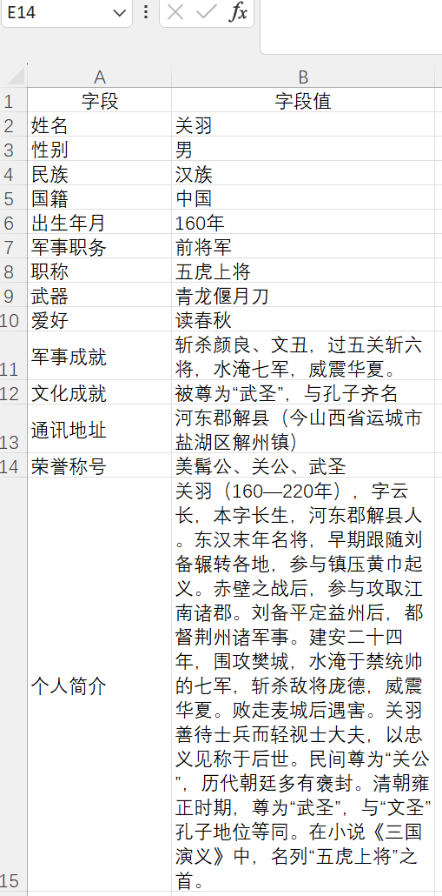
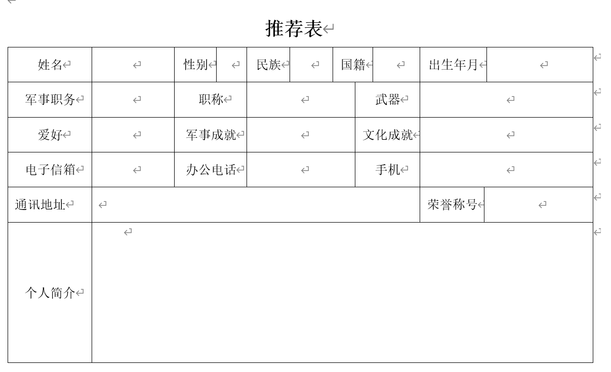
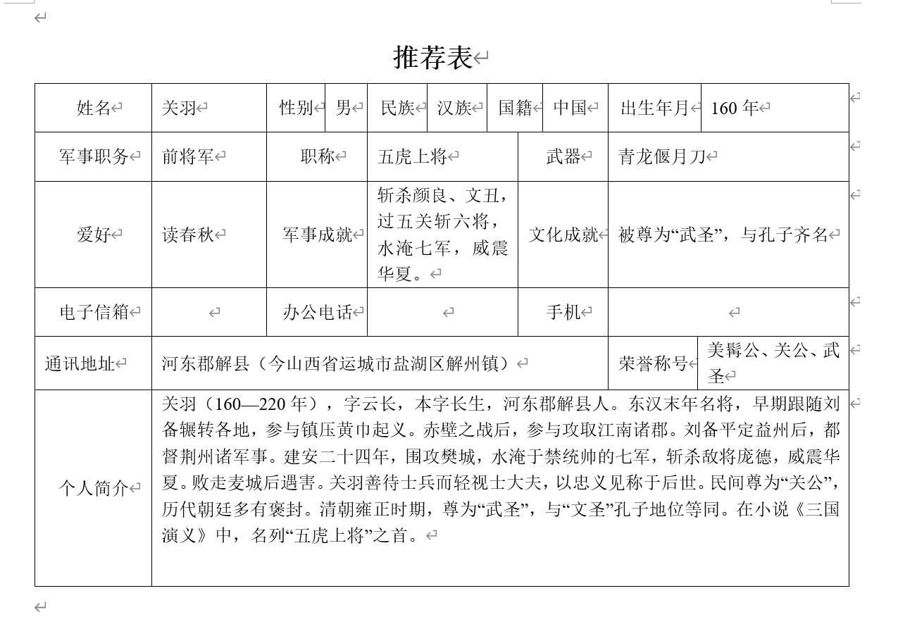

# AutoTable - 基于大语言模型的自动化智能表格生成应用

## 概述
传统的通过python来实现表格自动化操作的应用可能很难处理复杂的docx格式的表格，而大语言模型擅长处理非结构化的字段，从而增加了灵活性。本项目通过用户自定义的“知识库”文件，实现基于大语言模型对docx文件表格的自动填写。原理是使用大语言模型来分析表格结构，生成字段到单元格位置的映射。然后根据这个映射填充数据。支持本地Ollama调用和符合OpenAI协议的API。

## 主要功能
✅ 智能填写表格\
✅ 自定义知识库内容\
✅ 支持本地Ollama和云端API

## 快速开始
```bash
git clone https://github.com/Dukeway/Autotable.git
pip install -r requirements.txt
python main.py
```
## 应用设置
1.找到文件夹里的“知识库.xlsx"文件，将表格中的""字段"和“字段值”分别填写为你需要的内容。\
2.文件夹有个“表格模版.docx"文件，替换为需要填写的表格文件，注意名称同样为"表格模版.docx”。\
3.在config.py文件中进行设置，选择“api”或者“ollama"模式进行项目运行；如果使用api，那么需要填写你的秘钥；如果使用ollama，确保ollama在本地运行。注意正确填写模型名称。
## 应用示例
### 知识库



### 表格模版

自动化输出如下：


## 说明
由于依赖大语言模型解析表格的能力，因此小参数模型表现并不好。项目演示使用的是DeepSeek-V3，你也可以选择其他优秀的模型。如果通过ollama来运行，注意复杂的表格很可能无法识别，从而导致字段值插入错误位置。

如果想修改提示词，可以在autotable.py文件中修改。

---

# AutoTable - An Automated Smart Table Generation Application Based on Large Language Models

## Overview
Traditional applications that use Python to automate table operations may struggle to handle complex table structures in .docx format, whereas large language models excel at processing unstructured fields, offering greater flexibility. This project enables automatic table filling in .docx files based on a user-defined "knowledge base" file, leveraging large language models. The principle involves using a large language model to analyze the table structure, generate a mapping of fields to cell positions, and then populate the data according to this mapping. It supports local Ollama calls and APIs compatible with the OpenAI protocol.

## Features
✅ Smart table filling\
✅ Customizable knowledge base content\
✅ Support for local Ollama and cloud APIs

## Installation
```bash
git clone https://github.com/Dukeway/Autotable.git
pip install -r requirements.txt
python main.py
```

## Application Setup
Locate the "知识库.xlsx" (knowledge base) file in the folder and fill in the "fields" and "field values" columns with the content you need.
Replace the "表格模版.docx" (table template) file in the folder with the table file you want to fill, ensuring the name remains "表格模版.docx".
Configure settings in the config.py file by selecting either "api" or "ollama" mode to run the project. If using an API, provide your API key; if using Ollama, ensure it is running locally. Make sure to correctly specify the model name.

## Application Example
Since the code comments and files are in Chinese, the pictures are not shown here (they are shown in the Chinese introduction). You can still optimize this project by looking at the code, because this project is not perfect.
## Notes
Since the project relies on the table-parsing capabilities of large language models, smaller-parameter models may underperform. The project demo uses DeepSeek-V3, but you can choose other high-performing models as well. When running via Ollama, note that complex tables may not be recognized correctly, potentially causing field values to be inserted into the wrong positions.

If you want to modify the prompts, you can edit them in the autotable.py file.
